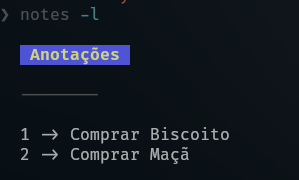

# notes-cli



O script é um bloco de notas cli, que permite criar, listar, editar e remover notas de um arquivo `notes.md`.
Ele utiliza um sistema de identificação numérica único (id) para cada nota,
facilitando a edição e a exclusão.
Além disso, o script fornece feedback ao usuário através de notificações e exibe as notas formatadas usando a ferramenta glow.

## Funcionalidades

1. Listar Notas:

Se o arquivo de notas `notes.md` não existir, uma mensagem informando que nenhuma nota foi criada ainda é exibida.
Caso o arquivo exista, as notas são exibidas junto com um cabeçalho, utilizando a ferramenta glow para formatação.

2. Gera ID Único:

Cria um ID numérico único para cada nova nota, garantindo que cada nota possa ser referenciada de maneira única.
O ID é gerado incrementando o último ID existente.

3. Adicionar Nota:

Permite adicionar uma nova nota, solicitando uma descrição se não for fornecida como argumento.
A nova nota é salva no arquivo `notes.md` com um ID único.
Uma notificação é enviada ao usuário informando que a nota foi criada.

4. Editar Nota:

Permite editar uma nota existente, especificando seu ID.
Se o ID não for fornecido, o usuário é solicitado a informá-lo.
Verifica se a nota existe e, se sim, substitui seu conteúdo com a nova descrição fornecida.
Uma notificação é enviada ao usuário informando que a nota foi editada com sucesso.
Remover Nota:

5. Remover Nota:
   Permite remover uma nota existente pelo ID. Se o ID não for fornecido, o usuário é solicitado a informá-lo.
   Verifica se a nota existe e, se sim, a remove do arquivo notes.md.
   Uma notificação é enviada ao usuário informando que a nota foi removida com sucesso.

6. Tratamento de Parâmetros:

O script aceita parâmetros de linha de comando para executar funções específicas (add, edit, remove, list).
Se uma opção inválida for fornecida, o script exibe uma mensagem de erro e uma ajuda com as opções válidas.

#### Uso:

O usuário pode interagir com o script usando os seguintes comandos:

Para adicionar uma nota:

```bash
notes -a "Minha nota"
```

Para editar uma nota:

```bash
notes -e 1 # onde 1 é o ID da nota
```

Para remover uma nota:

```bash
notes -r 1 # onde 1 é o ID da nota
```

Para listar as notas:

```bash
notes -l # Será exibido a listagem das notas
```

OBS: Veja que estou usando o script chamando-o como `notes`, isso ocorre porque criei
um alias no meu .zshrc para usa-lo dessa forma, caso deseje usar desse jeito basta
criar um alias no seu .zshrc, ex: `alias notes='$HOME/notes-cli/notes.sh'`
